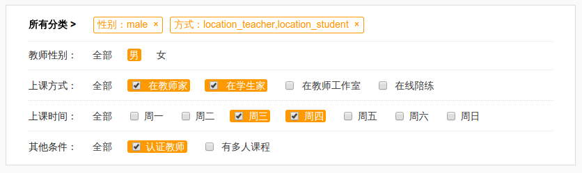

# FilterManager

filter manager package for product list filter,let`s elegant generate filter url.

This page used FilterManager: [kiteme.cn/list](http://kiteme.cn/list)

**[中文文档](https://github.com/toplan/FilterManager/blob/master/README_CN.md)**



# Install

```php
composer require 'toplan/filter-manager:~1.0.4'
```

# Usage

###1. The preparatory work

```php
require 'path/to/vendor/autoload.php';
use Toplan\FilterManager\FilterManager as FilterManager;

// params
$paramsArray = [
    'paramName' => 'value',
    ...
]

// create instance by yourself.
$fm = FilterManager::create($paramsArray)->setBlackList(['page']);

//then, render `$fm` value to your template!
```

**Or used in laravel just like this:**

Find the providers key in config/app.php and register the FilterManger Service Provider.
```php
    'providers' => array(
        Toplan\FilterManager\FilterManagerServiceProvider::class,
    )
```    
Find the aliases key in config/app.php.
```php
    'aliases' => array(
        'FilterManager' => Toplan\FilterManager\Facades\FilterManager::class,
    )
```

###2. Just enjoy it

use value `$fm` in template:
```html
<!-- example -->
<li class="item all {{$fm->isActive('gender', FM_SELECT_ALL, 'active', '')}}">
  <a href="{{$fm->url('gender', FM_SELECT_ALL)}}">All</a>
</li>
<li class="item @if($fm->isActive('gender', 'male')) active @endif">
  <a href="{{$fm->url('gender', 'male')}}">Male</a>
</li>
<li class="item @if($fm->isActive('gender', 'female')) active @endif">
  <a href="{{$fm->url('gender', 'female')}}">Female</a>
</li>
```

or use laravel facade value `FilterManager` in template:
```html
<!-- example -->
<li class="item all {{FilterManager::isActive('gender', FM_SELECT_ALL, 'active', '')}}">
  <a href="{{FilterManager::url('gender', FM_SELECT_ALL)}}">All</a>
</li>
<li class="item @if(FilterManager::isActive('gender', 'male')) active @endif">
  <a href="{{FilterManager::url('gender', 'male')}}">Male</a>
</li>
<li class="item @if(FilterManager::isActive('gender','female')) active @endif">
  <a href="{{FilterManager::url('gender', 'female')}}">Female</a>
</li>
```

# API

### create(array $filters, $baseUrl, $blackList)

create a instance.

- `$filters`: this is filters data, required, exp:['gender'=>'male', 'city'=>'beijing']

- `$baseUrl`: default value is empty string.

- `$blackList`: this is blacklist for filters, default value is `[]`, exp:['pageindex'].
 
### setBlackList(array $list)

set black list for filter.

example:
```php
$fm->setBlackList(['page', 'pageindex']);
//or in laravel
FilterManager::setBlackList(['page', 'pageindex']);
```

### has($filterName)

whether has the character filter, if true will return the value, if don`t return false.

example:
```php
$value = $fm->has('gender');

//or in laravel
$value = FilterManager::has('gender');
```

### isActive($filterName, $filterValue, $trueReturn, $falseReturn)

example:
```php
//in laravel
FilterManager::isActive('gender', 'male');//this will return true or false;

FilterManager::isActive('gender', 'male', 'active', '');//this will return 'active' or '';
```
 
### url($filterName, $filterValue, $multi, $linkageRemoveFilters, $blackList)

One filter has some values, and every value has a url, this method return a full url string.

- `$filterName`: param name, required.

- `$filterValue`: param value, default value is `FM_SELECT_ALL`.

- `$multi`: whether to support multiple values? `false` or `true`, default value is `false`.

- `$linkageRemoveFilters`：linkage remove the other filter, default value is `[]`.

- `$blackList`: temporary blacklist, default value is ``[]``.

example:
```php
//in laravel
FilterManager::url('gender', FM_SELECT_ALL);//without gender param

FilterManager::url('gender', 'male', false);//single value

FilterManager::url('cities', 'shanghai', true);
FilterManager::url('cities', 'beijing', true);//multiple values

// One province has many cities, one city has many counties ...,
// If you select 'all province' or one of provinces,
// you should linkage remove the selected cities and counties ...
//
// like this:
// select all province
FilterManager::url('province', FM_SELECT_ALL, false, ['cities', 'counties', ...]);//linkage remove selected cities
// select one province
FilterManager::url('province', 'sichuan', false, ['cities', 'counties', ...]);//linkage remove selected cities
```
