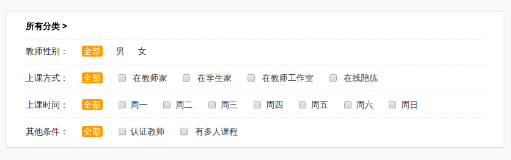

# 筛选条件(参数)管理器

该包主要用于资源列表页面筛选器，可以让我们优雅灵活的生成筛选链接。
这个页面就使用了该包：[kiteme.cn/list](http://kiteme.cn/list)




# 安装

```php
composer require 'toplan/filter-manager:~1.0.4'
```

# 打开姿势

###1. 准备工作

```php
//假设这是在你的控制器中
use Toplan\FilterManager\FilterManager as FilterManager;

//获取参数
$paramsArray = [
    'paramName' => 'value',
    ...
]

//生成管理器
$fm = FilterManager::create($paramsArray)->setBlackList(['page']);

//然后将变量`$fm`渲染到你的模板!
```

**或者直接在laravel中这样使用:**

在config/app.php文件中找到名为`providers`的key，然后为FilterManager的服务提供器。
```php
    'providers' => array(
        Toplan\FilterManager\FilterManagerServiceProvider::class,
    )
```

在 config/app.php文件中找到名为`aliases`的key， 然后为FilterManger添加别名。
```php
    'aliases' => array(
        'FilterManager' => Toplan\FilterManager\Facades\FilterManager::class,
    )
```

###2. Just enjoy it!

在模板中使用`$fm`:
```html
<!-- example -->
<li class="item all {{$fm->isActive('gender', FM_SELECT_ALL, 'active', '')}}">
  <a href="{{$fm->url('gender', FM_SELECT_ALL)}}">All</a>
</li>
<li class="item @if($fm->isActive('gender', 'male')) active @endif">
  <a href="{{$fm->url('gender', 'male')}}">Male</a>
</li>
<li class="item @if($fm->isActive('gender', 'female')) active @endif">
  <a href="{{$fm->url('gender', 'female')}}">Female</a>
</li>
```

在模板中使laravel facade `FilterManger`：
```html
<!-- example -->
<li class="item all {{FilterManager::isActive('gender', FM_SELECT_ALL, 'active', '')}}">
  <a href="{{FilterManager::url('gender', FM_SELECT_ALL)}}">All</a>
</li>
<li class="item @if(FilterManager::isActive('gender', 'male')) active @endif">
  <a href="{{FilterManager::url('gender', 'male')}}">Male</a>
</li>
<li class="item @if(FilterManager::isActive('gender','female')) active @endif">
  <a href="{{FilterManager::url('gender', 'female')}}">Female</a>
</li>
```

更多的详细用法参见: demo_temp_for_laravel.blade.php

# API

基本上所有常用用法都在该文件中: demo_temp_for_laravel.blade.php

### create($filters, $baseUrl, $blackList)

获得FilterManager对象。

- `$filters`: 参数数组，例:['gender'=>'male', 'city'=>'beijing']
- `$baseUrl`: 可以根据自己情况进行设置，默认为空，例:'www.example.com'
- `$blackList`: 筛选条件/参数黑名单，例:['pageindex']

### setBlackList(array $list)

设置筛选条件黑名单，可以在每次生成url的时候过滤掉你不想要的参数(比如分页参数等)

示例：
```php
$fm->setBlackList(['page', 'pageindex']);

//在laravel中
FilterManager::setBlackList(['page', 'pageindex']);
```

### has($filterName)

是否有指定筛选条件，如果有则返回值，如果没有则返回false。

示例：
```php
$value = $fm->has('gender');

//或在laravel中:
$value = FilterManager::has('gender');
```

### isActive($filterName, $filterValue, $trueReturn, $falseReturn)

指定的筛选条件是否包含指点值。

示例：
```php
$fm->isActive('gender','male');

//或在laravel中
FilterManager::isActive('gender', 'male');//将会返回true 或 false;

FilterManager::isActive('gender', 'male', 'active', '');//将会返回 'active' 或 '';
```

### url($filterName, $filterValue, $multi, $linkageRemoveFilters, $blackList)

生成url。
参数介绍：
- `$filterName`: 筛选条件/参数。
- `$filterValue`: 筛选条件/参数的值，默认值为：`FM_SELECT_ALL`，表示为所有。
- `$multi`: 是否支持多个参数值？true 为支持，默认为false。
- `$linkageRemoveFilters`: 需要联动删除的筛选条件/参数。
- `$blackList`: 临时黑名单，可以临时覆盖默认的黑名单。

示例：
```php
FilterManager::url('gender', FM_SELECT_ALL);//将会删除gender参数

FilterManager::url('gender', 'male', false);//gender只能有一个值

FilterManager::url('cities', '成都', true);#
FilterManager::url('cities', '绵阳', true);#支持cities有多个值

//假设我们要对城镇区域进行筛选，首先我们知道一个省有多个城市，城市又有多个区、镇...
//如果我们要选择‘全部’，或者选择任一一个其他省，
//那么我们还需要通过第四个参数设置联动取消‘市’,‘区’,‘镇’等等你想取消的筛选条件。
//
//选择全部
FilterManager::url('province', FM_SELECT_ALL, false, ['cities', 'counties', ...]);//联动删除cities等条件
//选择一个省
FilterManager::url('province', '四川', false, ['cities', 'counties', ...]);//联动删除cities等条件
